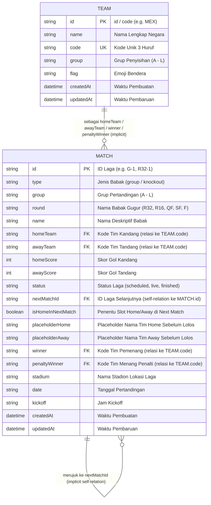

# Dokumentasi Database - World Cup 2026 Simulator

Dokumen ini menyediakan penjelasan mendalam mengenai arsitektur database, skema model, relasi entitas, dan konfigurasi yang digunakan pada aplikasi World Cup 2026 Simulator.

---

## 1. Database Overview

* **Nama Database**: `postgres` (Default database di Supabase)
* **DBMS yang Digunakan**: **PostgreSQL** (Hosted via **Supabase** cloud database service)
* **ORM (Object-Relational Mapping)**: **Prisma ORM (v7)**
* **Tujuan Penggunaan Database**: 
  Database digunakan untuk menyimpan informasi persisten terkait tim nasional peserta Piala Dunia (kolom nama, kode 3-huruf, grup, dan bendera emoji) serta detail data pertandingan dari babak penyisihan grup hingga babak final fase gugur. Data ini mencakup jadwal pertandingan, tanggal, jam kickoff, stadion, skor gol, status laga (`scheduled`, `live`, `finished`), serta referensi kelolosan tim ke fase berikutnya.

---

## 2. Entity Relationship Diagram (ERD)

Berikut adalah diagram hubungan entitas (ERD) yang memetakan model data secara logis pada aplikasi simulator ini. Hubungan relasional antar-tabel dilakukan secara implisit/logis pada kode backend menggunakan kode unik tim dan ID pertandingan.

---

## 3. Rincian Kamus Data (Data Dictionary)

### 3.1 Tabel `Team`
Menyimpan data statis/dinamis dari 48 negara peserta Piala Dunia 2026.

| Nama Kolom | Tipe Data | Atribut | Deskripsi |
| :--- | :--- | :--- | :--- |
| `id` | `String` | `@id` (PK) | ID unik tim (diisi sama dengan kode negara, contoh: `"MEX"`). |
| `name` | `String` | - | Nama lengkap negara peserta (contoh: `"Mexico"`). |
| `code` | `String` | `@unique` (UK) | Kode unik 3 huruf sesuai standar FIFA (contoh: `"MEX"`). |
| `group` | `String` | `@index` | Nama grup babak penyisihan (A sampai L). |
| `flag` | `String` | - | Representasi emoji bendera negara (contoh: `"🇲🇽"`). |
| `createdAt` | `DateTime` | `@default(now())` | Timestamp pembuatan data secara otomatis. |
| `updatedAt` | `DateTime` | `@updatedAt` | Timestamp pembaruan data secara otomatis. |

### 3.2 Tabel `Match`
Menyimpan seluruh data detail laga (total 103 pertandingan).

| Nama Kolom | Tipe Data | Atribut | Deskripsi |
| :--- | :--- | :--- | :--- |
| `id` | `String` | `@id` (PK) | ID unik pertandingan (contoh: `"G-1"`, `"R32-1"`). |
| `type` | `String` | `@index` | Jenis babak (`"group"` untuk grup, `"knockout"` untuk fase gugur). |
| `group` | `String` | `@index` (Optional) | Karakter grup babak penyisihan (A - L). Bernilai `null` pada fase knockout. |
| `round` | `String` | `@index` (Optional) | Kode babak gugur (`R32`, `R16`, `QF`, `SF`, `F`). Bernilai `null` pada fase grup. |
| `name` | `String` | Optional | Deskripsi babak gugur (contoh: `"Round of 32"`, `"Final"`). |
| `homeTeam` | `String` | Optional | Kode tim kandang (merujuk ke `Team.code`). |
| `awayTeam` | `String` | Optional | Kode tim tandang (merujuk ke `Team.code`). |
| `homeScore` | `Int` | Optional | Jumlah gol yang dicetak tim kandang. Default `null` sebelum tanding. |
| `awayScore` | `Int` | Optional | Jumlah gol yang dicetak tim tandang. Default `null` sebelum tanding. |
| `status` | `String` | - | Status kelangsungan laga (`"scheduled"`, `"live"`, `"finished"`). |
| `nextMatchId` | `String` | Optional | Referensi ID pertandingan berikutnya setelah memenangkan laga babak gugur saat ini. |
| `isHomeInNextMatch`| `Boolean` | Optional | Jika `true`, pemenang laga ini akan mengisi slot `homeTeam` di laga selanjutnya. |
| `placeholderHome` | `String` | Optional | Teks panduan tim kandang sebelum ditentukan (contoh: `"Winner Group A"`). |
| `placeholderAway` | `String` | Optional | Teks panduan tim tandang sebelum ditentukan (contoh: `"Runner-up Group B"`). |
| `winner` | `String` | Optional | Kode negara pemenang pertandingan (merujuk ke `Team.code`). |
| `penaltyWinner` | `String` | Optional | Kode negara pemenang adu penalti (jika skor berakhir seri pada laga knockout). |
| `stadium` | `String` | Optional | Nama stadion penyelenggara (contoh: `"Azteca Stadium"`). |
| `date` | `String` | Optional | Hari/Tanggal pertandingan (contoh: `"Jun 11, 2026"`). |
| `kickoff` | `String` | Optional | Jam mulainya laga (contoh: `"18:00"`). |
| `createdAt` | `DateTime` | `@default(now())` | Timestamp pembuatan data secara otomatis. |
| `updatedAt` | `DateTime` | `@updatedAt` | Timestamp pembaruan data secara otomatis. |

---

## 4. Indeks Database (Database Indexes)
Prisma dikonfigurasi untuk membuat indeks secara otomatis pada kolom-kolom berikut guna mengoptimalkan kecepatan pencarian (query performance):
1. **Tabel `Team`**: Indeks pada kolom `group` karena klasemen dibaca per grup secara berkala.
2. **Tabel `Match`**: 
   * Indeks gabungan pada `[type, group]` untuk mempercepat penyaringan jadwal pertandingan berdasarkan grup.
   * Indeks pada kolom `round` untuk mempercepat pembacaan data bagan bracket per babak gugur.
